Channel information
===================
    

Channel information at: T = 24.0 degC, E_rev = 0 mV, [Ca2+] = 5e-06 mM

<table>
    <tr>
<td width="120px">
            <b>Nasoma</b> 
            <a href="../Nasoma.channel.nml">Nasoma.channel.nml</a> 
            <b>Ion: na</b> 
            <i>g = gmax * m3 * h </i> 
            Na+ channel description (from Martina, Vida and Jonas 2000, Marina and Jonas 1997 - modeled by Skinner lab 2003, modified by Lawrence 2006)
</td>
<td>
<a href="Nasoma.inf.png">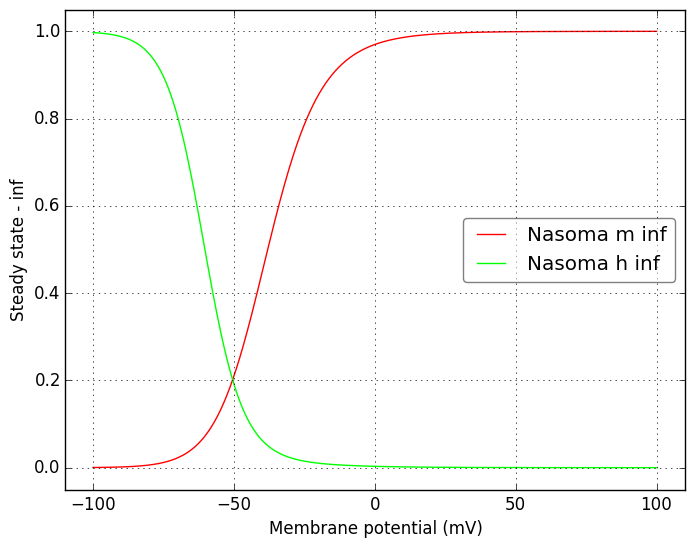</a>
</td>
<td>
<a href="Nasoma.tau.png">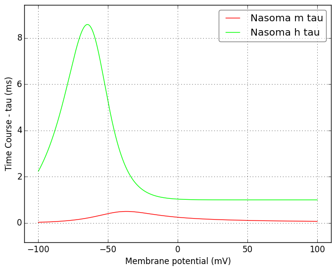</a>
</td>
</tr>
    <tr>
<td width="120px">
            <b>Nadend</b> 
            <a href="../Nadend.channel.nml">Nadend.channel.nml</a> 
            <b>Ion: na</b> 
            <i>g = gmax * m3 * h </i> 
            Na+ channel description (from Martina, Vida and Jonas 2000, Marina and Jonas 1997 - modeled by Skinner lab 2003, modified by Lawrence 2006)
</td>
<td>
<a href="Nadend.inf.png">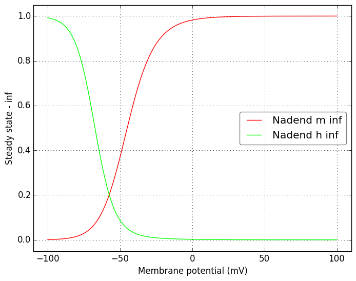</a>
</td>
<td>
<a href="Nadend.tau.png">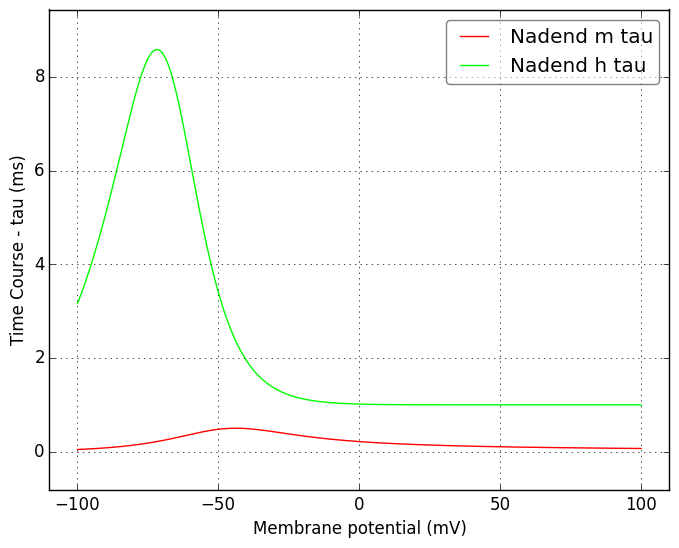</a>
</td>
</tr>
    <tr>
<td width="120px">
            <b>IKCa</b> 
            <a href="../IKCa.channel.nml">IKCa.channel.nml</a> 
            <b>Ion: k</b> 
            <i>g = gmax * o </i> 
            Ca++ activated mAHP K+ channel description (from Moczydlowski and Latorre 1983 - modeled by Poirazi 2003 modified by Lawrence 2006)
</td>
<td>
<a href="IKCa.inf.png">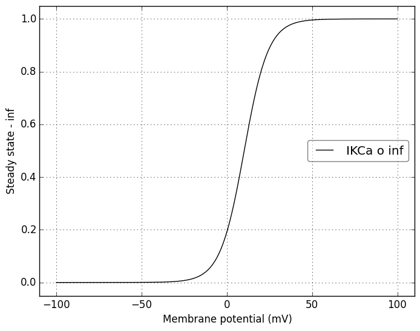</a>
</td>
<td>
<a href="IKCa.tau.png">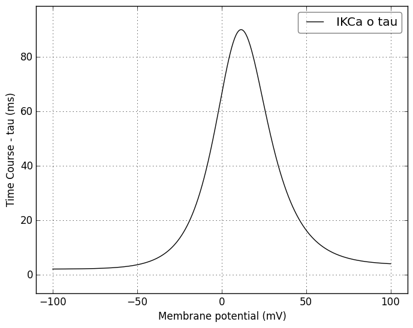</a>
</td>
</tr>
    <tr>
<td width="120px">
            <b>IKa</b> 
            <a href="../IKa.channel.nml">IKa.channel.nml</a> 
            <b>Ion: k</b> 
            <i>g = gmax * m * h </i> 
            A-type K+ channel description (from Lien 2002 - modeled by Migliore 2003)
</td>
<td>
<a href="IKa.inf.png">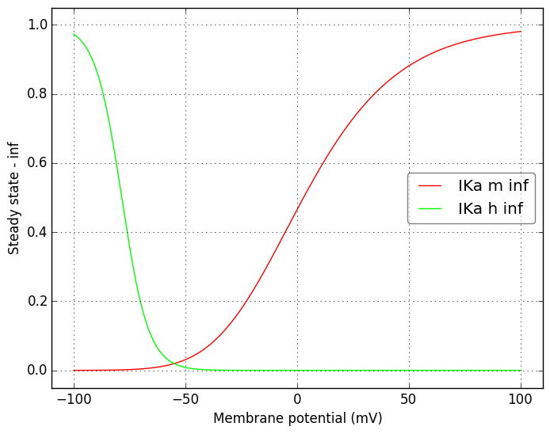</a>
</td>
<td>
<a href="IKa.tau.png">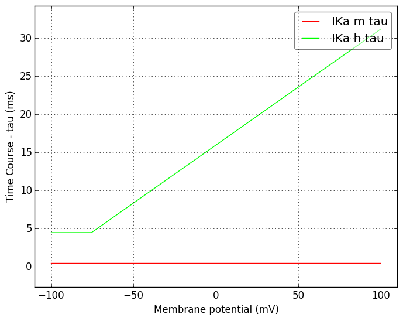</a>
</td>
</tr>
    <tr>
<td width="120px">
            <b>IMmintau</b> 
            <a href="../IMmintau.channel.nml">IMmintau.channel.nml</a> 
            <b>Ion: k</b> 
            <i>g = gmax * m </i> 
            IM current ...???
</td>
<td>

</td>
<td>

</td>
</tr>
    <tr>
<td width="120px">
            <b>Ikdrf</b> 
            <a href="../Ikdrf.channel.nml">Ikdrf.channel.nml</a> 
            <b>Ion: k</b> 
            <i>g = gmax * m * h </i> 
            Fast delayed rectifier K+ channel description  (from Lien 2002 - modeled by Migliore 2003)
</td>
<td>

</td>
<td>

</td>
</tr>
    <tr>
<td width="120px">
            <b>Ikdrs</b> 
            <a href="../Ikdrs.channel.nml">Ikdrs.channel.nml</a> 
            <b>Ion: k</b> 
            <i>g = gmax * m * h </i> 
            Slow delayed rectifier K+ channel description  (from Lien 2002 - modeled by Migliore 2003)
</td>
<td>

</td>
<td>
<a href="Ikdrs.tau.png">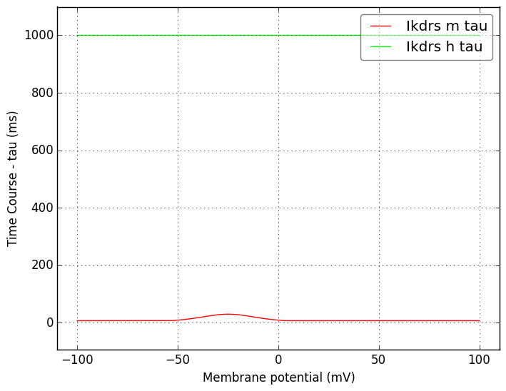</a>
</td>
</tr>
    <tr>
<td width="120px">
            <b>ICaT</b> 
            <a href="../ICaT.channel.nml">ICaT.channel.nml</a> 
            <b>Ion: ca</b> 
            <i>g = gmax * m2 * h </i> 
            T type Ca++ channel (from Jaffe 1994 - modeled by Migliore, modified by Lazarewicz 2001)
</td>
<td>
<a href="ICaT.inf.png">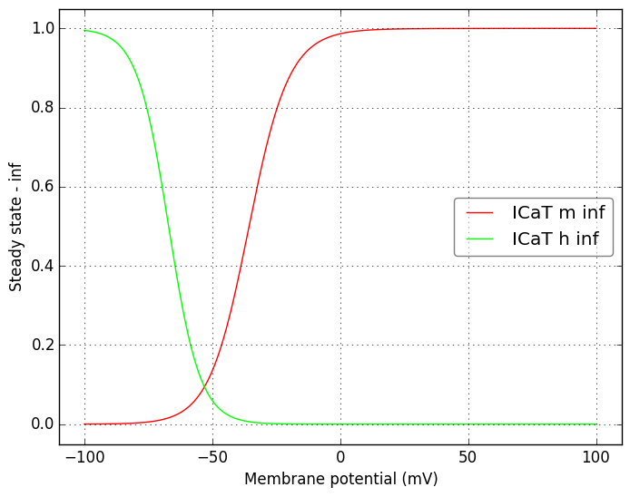</a>
</td>
<td>

</td>
</tr>
    <tr>
<td width="120px">
            <b>Ih</b> 
            <a href="../Ih.channel.nml">Ih.channel.nml</a> 
            <b>Ion: h</b> 
            <i>g = gmax * r </i> 
            hyperpolarization-activated nonspecific Na+ and K+ channel description (from Maccaferri and McBain 1996, Maccaferri 1993, Pape 1996, Magee 1998 - modeled by Skinner lab 2003)
</td>
<td>

</td>
<td>
<a href="Ih.tau.png">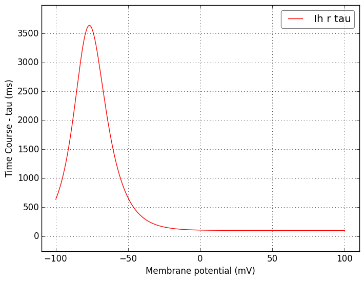</a>
</td>
</tr>
</table>

