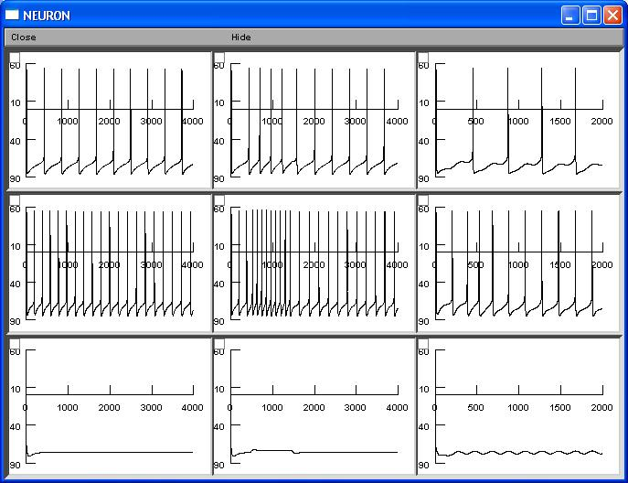

<html><pre>
# CA1-Oriens-Lacunosum-Moleculare---Lawrence-et-al.-2006
Lawrence JJ, Saraga F, Churchill JF, Statland JM, Travis KE, Skinner FK, McBain CJ (2006) Somatodendritic Kv7-KCNQ-M channels control interspike interval in hippocampal interneurons. J Neurosci 26:12325-38

This is the readme for the model associated with the paper:

Lawrence JJ, Saraga F, Churchill JF, Statland JM, Travis KE, Skinner FK, McBain CJ (2006) Somatodendritic Kv7-KCNQ-M channels control interspike interval in hippocampal interneurons. J Neurosci 26:12325-38

Usage:
Download and extract the archive and then under

ms-win
------
Compile the mod files by running mknrndll and changing to the extracted folder and selecting to create the nrnmech.dll. Then double click on the mosinit.hoc file

linux/unix
----------
Compile the mod files by running nrnivmodl in the extracted folder. Then run "nrngui mosinit.hoc"

mac os x
--------
Drag and drop the extracted folder onto the mknrndll icon.  Drag and drop the mosinit.hoc file from the extracted folder onto the nrngui icon.

----------
Once the simulation starts you can create subplots of Fig 9 by clicking the appropriately labeled buttons or you can create the whole figure by clicking the create all of fig 9 button (lower right in control box).

Note: The variable step method was used in this demo, if you would like to run the simulation as in the publication you can run cvode_active(0).

The model files were supplied by Dr Saraga.
